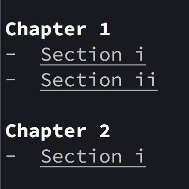

# Terminology

A simple way to color terminal output! ❤️ 💛 💚 💙 💜


## Color output with ease

```{code-block} python
---
caption: use the [`in_{color}()`](./in_color.md) functions to color strings
---

from terminology import in_red, in_yellow, in_green, in_blue, in_magenta

print(
    in_red("it's"),
    in_yellow("a"),
    in_green("double"),
    in_blue("rainbow"),
    in_magenta("dude...")
)
```


## Color the background too

```{code-block} python
---
caption: use the [`on_{color}()`](./on_color.md) functions to change the background color of strings
---

from terminology import on_green, on_yellow, on_red

print(
    on_green(" OK "),
    on_yellow(" WARNING "),
    on_red(" DANGER ")
)
```


## Emphasize text

```{code-block} python
---
caption: underline strings with underlined() or make them bold with bold()
---

from terminology import in_bold, underlined

print(in_bold("Chapter 1"))
print("- ", underlined("Section i"))
print("- ", underlined("Section ii"), "\n")

print(in_bold("Chapter 2"))
print("- ", underlined("Section i"), '\n')
```





## Mix it up!

```{code-block} python
---
caption: combine styles together
---
from terminology import in_bold, in_red, in_green, on_yellow, on_cyan, underlined

print(
    f"{in_bold(in_red(on_cyan(' Toto ')))}, I've a "
    f"{underlined(in_green('feeling'))} we're not in "
    f"{in_blue(on_yellow(in_bold(' Kansas ')))} anymore..."
)
```


