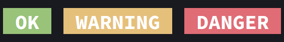
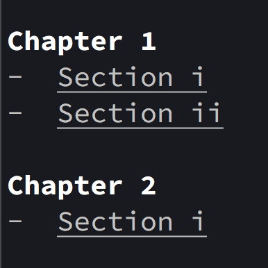
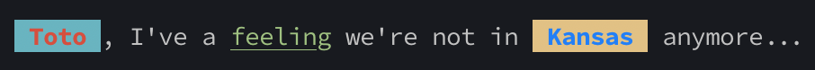

.. terminology documentation master file, created by
   sphinx-quickstart on Sat Apr 23 17:03:39 2022.
   You can adapt this file completely to your liking, but it should at least
   contain the root `toctree` directive.

===========
Terminology
===========

A simple way to color terminal text! ❤️ 💛 💚 💙 💜

Color Text
==========

.. code-block::
   :caption: color text in red, yellow, green, blue, magenta, black, or white

    from terminology import in_red, in_yellow, in_green, in_blue, in_magenta

    print(in_red("it's"), in_yellow("a"), in_green("double"), in_blue("rainbow"), in_magenta("dude..."))

.. image:: ./_static/pics/coloring.png

Color Text Background
=====================

.. code-block::

        from terminology import on_green, on_yellow, on_red

        print(on_green("OK"), on_yellow("WARNING"), on_red("DANGER")

Emphasize Text with Bold and Underlining
========================================

.. code-block::
   :caption: color text in red, yellow, green, blue, magenta, black, or white

    from terminology import in_bold, underlined

    print(in_bold("Chapter 1"))
    print("- ", underlined("Section i"))
    print("- ", underlined("Section ii"), "\n")

    print(in_bold("Chapter 2"))
    print("- ", underlined("Section i"), '\n')

Mix it up!
==========

.. code-block::

    print(
        f"{in_red(' Toto ').on_cyan().in_bold()}, I've a "
        f"{in_green('feeling').underlined()} we're not in "
        f"{in_blue(' Kansas ').on_yellow().in_bold()} anymore..."
    )

